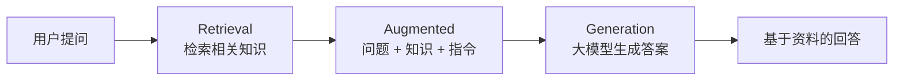
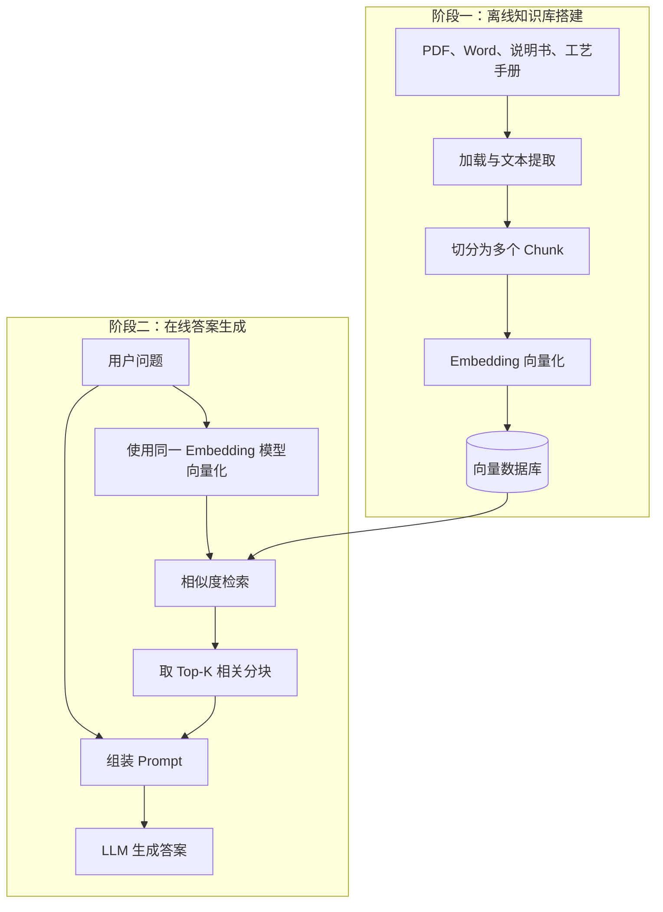
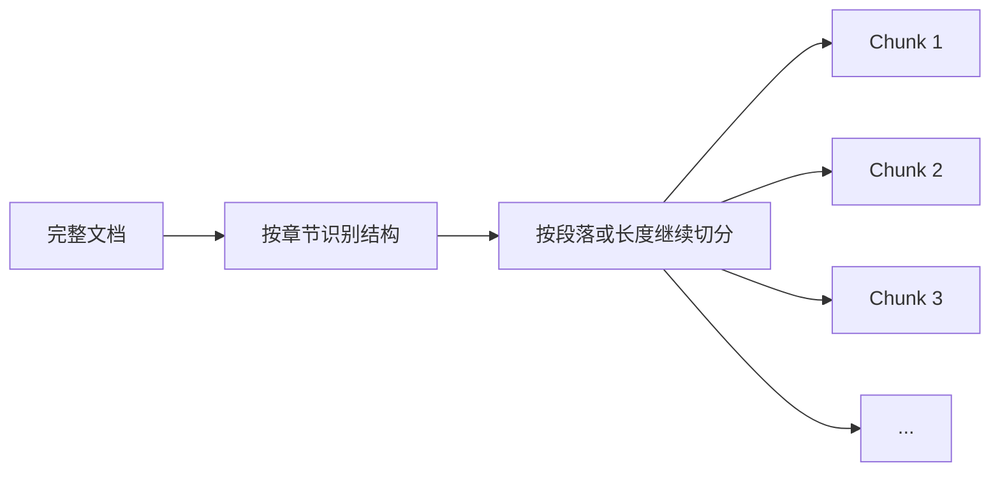
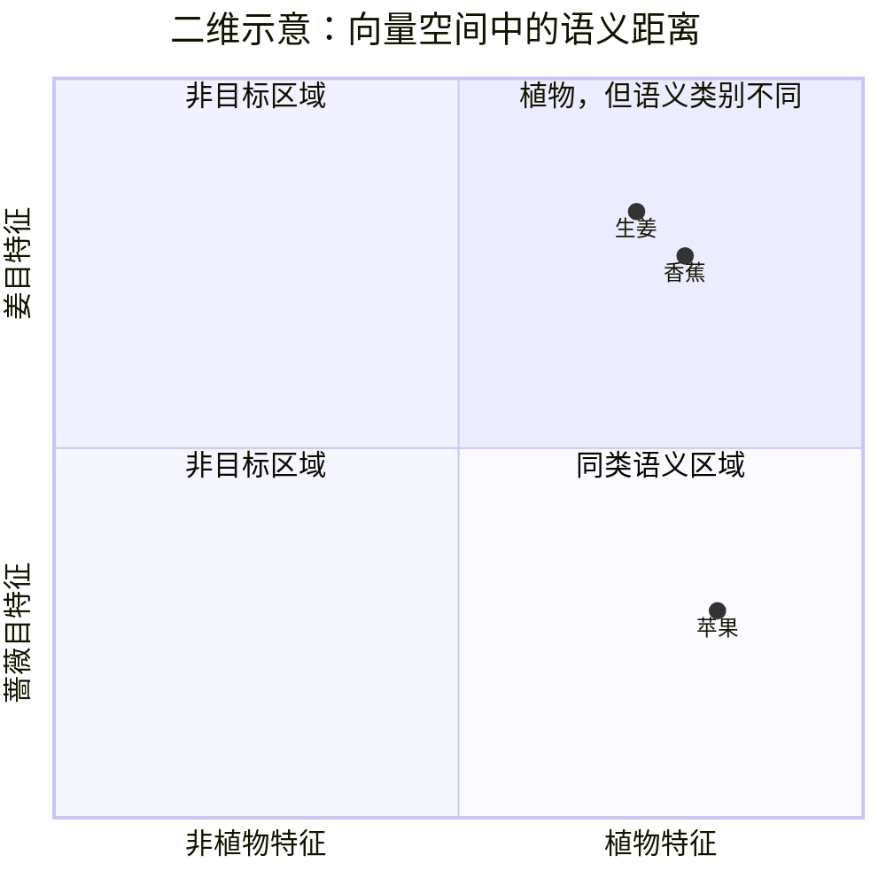
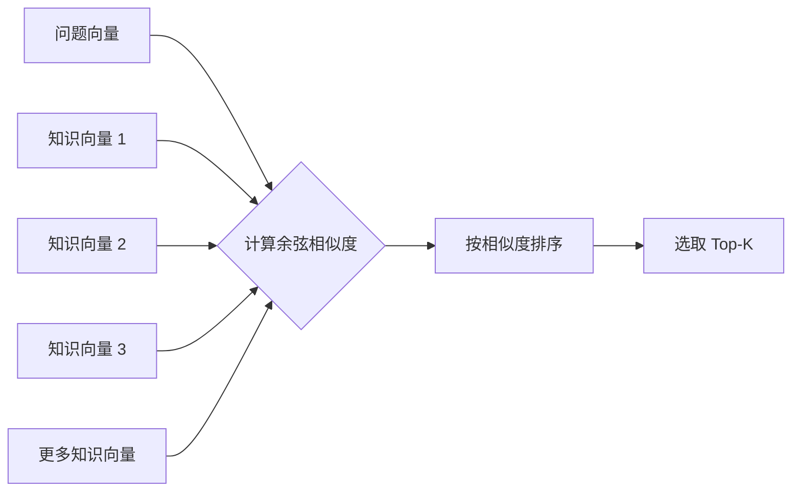

# 从零理解 RAG：让大模型先查资料，再回答问题

> 这是我对 RAG 的一次系统梳理。我会尽量绕开复杂术语，从“为什么需要 RAG”开始，一步步说明它如何把企业知识交给大模型使用。

在我看来，大语言模型很擅长组织语言，却不天然掌握企业内部资料，也无法保证每次回答都符合事实。RAG（Retrieval-Augmented Generation，检索增强生成）提供了一条很实用的路径：**先从可信知识库中检索相关资料，再让大模型基于资料生成答案。**

我更愿意把它理解为一套连接企业知识与大模型的知识工程方案，而不是重新训练一个模型。

## 一、RAG 到底是什么

我把 RAG 拆成三个动作：

1. **Retrieval，检索**：收到问题后，先去知识库查找相关资料。
2. **Augmented，增强**：把检索结果和用户问题按照模板组成 Prompt。
3. **Generation，生成**：要求大模型阅读资料，并根据 Prompt 生成回答。



我把 RAG 的本质概括为一句话：

> 不让大模型只凭自身参数“猜答案”，而是先给它找到可信资料，再要求它据此作答。

我认为这一点非常重要，因为大语言模型本质上是根据上下文预测后续内容的概率模型。它擅长生成“语言上合理”的文本，但“合理”不等于“真实”。当模型不知道正确答案时，也可能生成一个概率上看似合适、事实上却错误的答案，这就是我们常说的“幻觉”。

## 二、为什么需要 RAG

### 1. 大模型存在知识边界

模型的知识主要来自训练数据，因此天然受到以下限制：

- 训练数据不可能包含所有知识；
- 训练完成后出现的新信息无法自动进入模型；
- 企业制度、项目说明书、工艺手册等私有资料通常不在公开训练数据中；
- 即使模型接触过相关信息，也不能保证准确召回。

因此，我不会单独依赖大模型回答企业内部问题。

### 2. 把全部资料塞进 Prompt 并不现实

直接把所有企业文档交给模型，看起来简单，却会遇到三个问题：

- **上下文容量有限**：企业知识总量往往超过模型可接收的范围；
- **长文本检索效果下降**：上下文越长，模型越难稳定关注真正相关的信息；
- **时间和 Token 成本过高**：每次提问都传入全部文档，会造成巨大的延迟和费用。

这里我以“部分顶级模型支持约 200 万 Token、约 150 万字”为例。即便模型能够接收这么长的内容，当输入量持续增大时，关键信息的召回效果仍可能明显下降。

不过，我也需要补充一个边界：**上下文上限、注意力衰减和召回率取决于具体模型、资料结构与评测任务，不能把某组数字视为适用于所有模型的固定规律。** 我真正想表达的是，模型“能够放下”一篇长文，不等于模型“能够稳定、准确地使用”长文中的每一条信息。

我的解决思路是：提前把大文档拆成可检索的小片段，每次只取与当前问题最相关的少量内容。

## 三、RAG 的完整工作流

我把一套基础 RAG 系统分为两个阶段：

- **阶段一：知识库搭建**，提前处理企业资料；
- **阶段二：答案生成**，用户提问时实时检索并回答。



下面我分别展开这两个阶段。

## 四、阶段一：搭建可检索的知识库

### 1. 加载并统一文档

我接触到的企业知识通常会分散在多种载体中，例如：

- 项目说明书；
- 工艺手册；
- PDF、Word 等办公文档；
- 其他结构化或非结构化资料。

所以我的第一步，是读取这些文件，并将内容提取为系统可以统一处理的文本。

### 2. 将长文本切分为 Chunk

提取出长文本后，我不会直接把它作为一个整体使用，而是先拆成许多较小的文本分块，也就是 Chunk。

我常用的切分依据包括：

- 固定字符数或 Token 数；
- 句号、段落等标点边界；
- 标题、章节等文档结构。



我做分块的目的不是单纯把文档切短，而是建立合适的**检索粒度**：

- 分块太大，会混入大量无关信息，增加 Token 成本；
- 分块太小，可能破坏上下文，使一个完整事实被拆散；
- 合理的分块应该尽量保持语义完整，同时便于精确召回。

### 3. 使用 Embedding 将文本向量化

计算机最终处理的是数字。为了让系统判断两个文本在语义上是否相近，我需要先用 Embedding 模型把每个 Chunk 转换成一个向量。

我习惯把 Embedding 想象成一个“语义坐标生成器”：

- 输入一段文本；
- 模型理解其中的语义特征；
- 输出一个包含大量数字的高维向量；
- 语义越接近的文本，通常在向量空间中的距离越近。

为了说明“升维”的价值，我用苹果、香蕉和生姜做一个简单类比：

- 在一维空间中，很难同时表达多个语义特征；
- 增加维度后，可以从“界、门、纲、目、科、属、种”等多个角度描述对象；
- 维度继续增加后，模型可以表达远比二维坐标更丰富的语义关系。



这张二维图只是我为了方便理解而做的简化。真实 Embedding 往往包含数百到数千个维度，例如 3072 维。每个维度通常不能被简单解释成某个明确分类，但整个向量共同编码了文本的语义特征。

> 我会用“维度越高，语义关系越容易被表达”帮助自己入门，但这并不是一条严格定律。实际效果还取决于模型训练质量、数据领域、向量维度、切分策略和检索方法。

### 4. 写入向量数据库

所有 Chunk 完成向量化后，我会把向量连同文本、来源等信息一起存入向量数据库。

向量数据库的核心能力是：在海量向量中快速找到与查询向量最相似的内容。这样，系统不必在每次提问时从头阅读全部文档，而可以在较短时间内定位候选资料。

到这里，我就完成了知识库的搭建。

## 五、阶段二：从问题到答案

### 1. 将用户问题向量化

假设我的用户问：

> 苹果多少钱一个？

我首先使用与知识库相同的 Embedding 模型，把问题转换成查询向量。

我之所以必须使用同一套向量化模型，是因为知识分块和用户问题需要位于同一个语义空间。不同模型生成的坐标体系通常不能直接比较。

### 2. 计算相似度并选出 Top-K

有了问题向量后，我会让系统将其与向量数据库中的知识向量进行比较。这里我使用的常见方法之一是余弦相似度：

$$
\cos(\theta)=\frac{\vec{A}\cdot\vec{B}}{\lVert\vec{A}\rVert\lVert\vec{B}\rVert}
$$

其中：

- $\vec{A}$ 和 $\vec{B}$ 分别代表两个向量；
- 夹角越小，余弦相似度越高；
- 相似度越高，通常表示两段文本的语义越接近。

接下来，我会让系统按相似度排序，取最相关的前 K 个分块，这就是 **Top-K 检索**。



### 3. 将资料装入 Prompt

假设我检索到三个分块：

- 分块一：苹果手机 5999 元一个；
- 分块二：苹果 5 元一个；
- 分块三：青苹果比红苹果难吃。

我会把这些分块、用户问题和回答要求一起放入 Prompt：

```text
你是一名客服。请仅根据下面的参考资料回答用户问题。
如果资料不足以支持答案，请明确说明无法确定，不要自行编造。

参考资料：
1. 苹果手机 5999 元一个。
2. 苹果 5 元一个。
3. 青苹果比红苹果难吃。

用户问题：
苹果多少钱一个？

请给出准确、简洁的答案，并说明依据。
```

最后，我再让大模型阅读 Prompt 并生成回答。

这里我还需要注意，“苹果”既可能指水果，也可能指手机品牌。基础向量检索可能同时召回两类资料，因此 Prompt 约束、上下文判断以及必要的追问仍然很重要。在我的理解里，RAG 能降低幻觉，但不能自动消除歧义，更不能替代业务规则。

## 六、RAG 为什么更省成本

在我描述的这套基础架构中，只有最后的答案生成步骤需要调用生成式大模型；文档和问题的语义编码由 Embedding 模型完成，检索由向量数据库完成。

与“每次都把全部资料发给大模型”相比，RAG 只发送 Top-K 相关分块，因此通常能够：

- 减少输入 Token；
- 缩短响应时间；
- 降低模型调用成本；
- 提高关键信息在上下文中的占比；
- 让回答更容易追溯到企业内部资料。

## 七、这套方案的关键控制点

从整个流程可以看出，我不能把 RAG 的回答质量只归因于最后的大模型。任何一个环节出现问题，都可能影响最终结果。

| 环节 | 关键问题 | 可能后果 |
| --- | --- | --- |
| 文档提取 | 是否完整、准确地读取源文本 | 知识缺失或乱码 |
| Chunk 切分 | 是否保持语义完整 | 事实被截断或混入噪声 |
| Embedding | 是否适合当前语言与领域 | 相似内容无法靠近 |
| 向量检索 | 相似度与 Top-K 是否合理 | 漏召回或召回无关内容 |
| Prompt | 是否约束模型基于资料回答 | 模型忽略资料或继续编造 |
| LLM 生成 | 是否能理解问题和上下文 | 表达错误或处理歧义失败 |

因此，我不会把 RAG 简单理解为“接一个向量数据库”。在我看来，它是一条完整链路：

> 文档处理 → 分块 → 向量化 → 存储 → 问题向量化 → 相似度检索 → Top-K → Prompt → LLM。

## 八、我的核心结论

通过这次梳理，我得到七个核心结论：

1. **我把 RAG 看作一套知识工程方案，而不是一个新的大模型。**
2. **我主要用它解决“模型不知道私有知识”和“模型可能凭概率编造答案”这两个问题。**
3. **在知识库搭建阶段，我最关注分块、向量化和向量存储。**
4. **在在线问答阶段，我使用同一 Embedding 模型编码问题，再通过相似度找到 Top-K 资料。**
5. **我会把检索结果、用户问题和回答指令一起组成 Prompt，最后再交给大模型生成答案。**
6. **我只向大模型提供少量相关资料，从而降低上下文长度、延迟和 Token 成本。**
7. **我不会把 RAG 当成绝对正确的保证。分块、召回、歧义处理和 Prompt 约束仍然决定最终质量。**

## 结语

我会把普通大模型想象成一个主要依靠记忆回答问题的人，而 RAG 为它增加了一套“先查资料、再作答”的工作流程。

在我看来，这套机制的价值不在于让模型记住更多内容，而在于让模型回答当前问题时，能够及时获得更相关、更私有、也更容易追溯的依据。对于企业知识问答、内部客服、制度查询和技术文档助手等场景，这正是我认为 RAG 最核心的意义。
